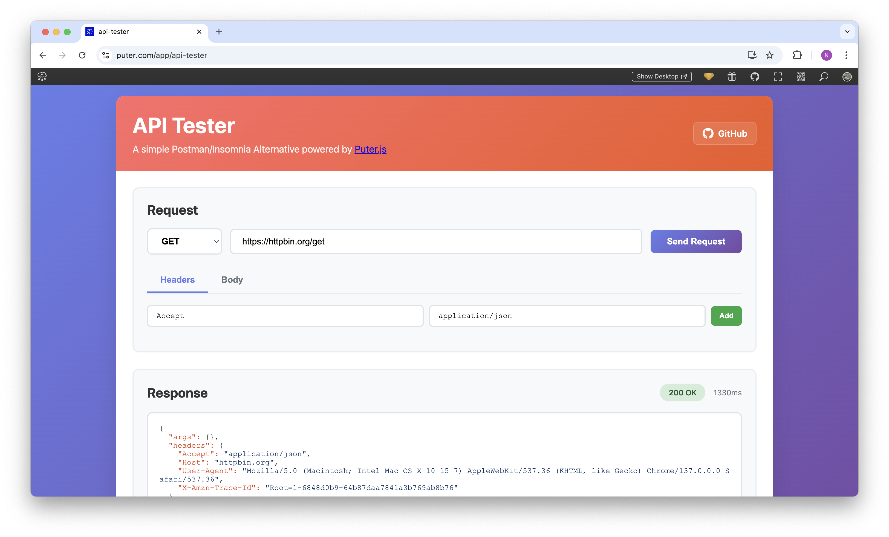

<h1 align="center">
  <a href="https://puter.com/app/api-tester" target="_blank">API Tester</a>
</h1>

<p align="center">A simple web-based API testing tool that allows you to test HTTP APIs, similar to Postman or Insomnia.
</p>

<p align="center">
  
</p>

## Features

- **Multiple HTTP Methods**: Support for GET, POST, PUT, DELETE, PATCH, HEAD, and OPTIONS requests
- **Custom Headers**: Add and manage custom HTTP headers for your requests
- **Request Body Support**: Send JSON, text, or other data in request bodies
- **Response Visualization**: View formatted JSON responses with syntax highlighting
- **Response Metrics**: See response status codes, status text, and response times
- **Modern UI**: Clean, responsive interface that works on all devices
- **No Installation Required**: Runs directly in your browser

## Getting Started

Clone the repository: 

```bash
git clone https://github.com/puter-apps/api-tester.git
```

and open the `/src/index.html` file in your browser.

## How It Works

This API Tester leverages **Puter.js** to overcome the fundamental challenge of cross-origin requests in web browsers. Traditional web applications are restricted by CORS (Cross-Origin Resource Sharing) policies, which prevent direct API calls to external domains from browser-based JavaScript.

Specifically, the application uses [`puter.net.fetch()`](https://docs.puter.com/Networking/fetch/) to make cross-origin HTTP requests and bypass CORS restrictions. This allows the app to test any public API endpoint without server-side configuration.

## License

MIT
